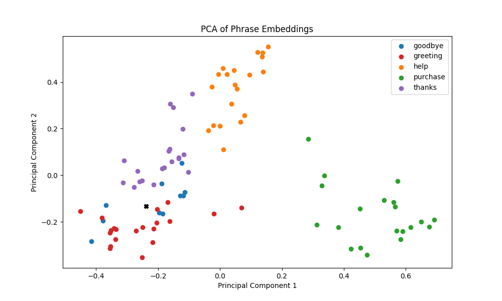
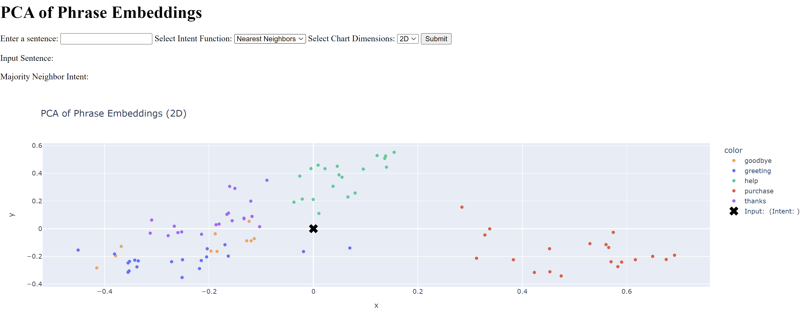

# IntentEmbedSpace

Proof-of-concept for Intent Embedding Space.

Taking a simple mapping of phrases with matching intents, we can visualize the semantic space of intents using the embedding layer of a pre-trained language model.



## Usage

```bash
pip install -r requirements.txt
```

```bash
python main.py
```

### To run an interactive web app

```bash
python app.py
```


